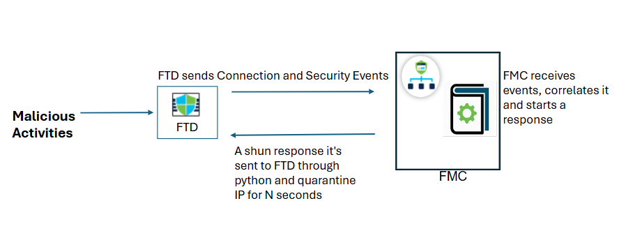
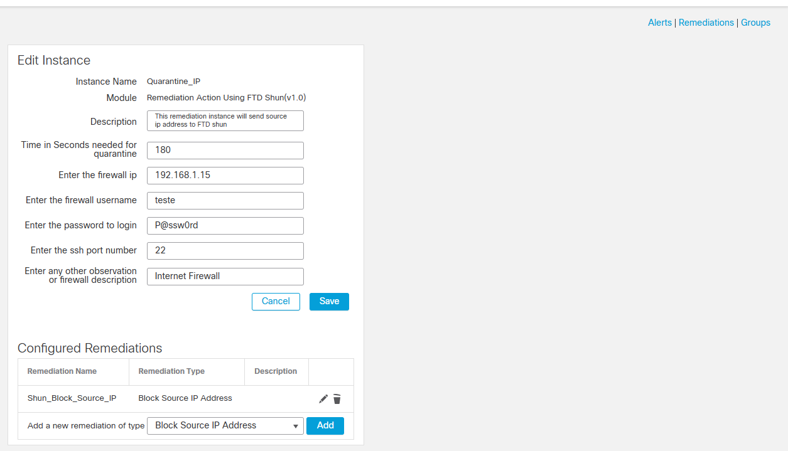
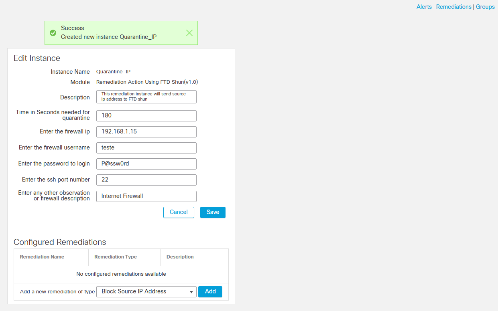

# fmc-remediation-module-shun

[](https://developer.cisco.com/codeexchange/github/repo/vagner-instructor/fmc-remediation-module-ftd-shun)

# Cisco FMC Remediation Module for FTD Shun

The FMC Remediation Module for FTD Shun module in this repository sends a shun command to a FTD. The following products are being used:

- Cisco Secure Firewall
- Cisco Secure Firewall Management

This repository shows a simple example of a remediation module that can be installed in Cisco
Firepower Management Center (FMC). When adverse conditions in a customer's network violate an FMC
correlation policy, this module can trigger an automation response and shun an ip address for a specific time in seconds.



This repository contains a small python code [example workflow](./module/ftd_shun.py). The python
receives the source ip address, input data to paramiko connection and shun the source ip, it waits for N seconds and then remove shun.
This blocks the offending source IP in Cisco Secure Firewall
automatically, therefore also blocking any newer attack attempts by that source IP for N seconds.

## Installation

Clone the repo
```bash
git clone https://github.com/vagner-instructor/fmc-remediation-module-ftd-shun.git
```

Go to your project folder
```bash
cd fmc-remediation-module-ftd-shun
```

Create the remediation module package
```bash
tar -C module -czf ftd_shun_remediation_module.tar.gz module.template ftd_shun.py
```

### Install the package as a remediation module in FMC.

1. Navigate to **Polices -> Actions -> Modules**. Click on **Choose File** and select the
`ftd_shun_remediation_module.tar.gz` file generated from the previous command.


2. Once installed, click on the  icon next to
the module to view the details.


## Configuration

### Pre-requisites

Firewall FTD username and password
Firewall FTD ip address

```
teste
P@ssword
192.168.1.15
```

### Create a new remediation instance in FMC.

1. On the remediation module details screen, click on the **Add** button under
**Configured Instances**. Provide a name, description, Firewall details and **Time of Quarantine** in seconds for the
instance and click on **Create**.



2. Click on the **Add** button to add a remediation action of one of the types available from the
dropdown.



3. Provide a name and description for the remediation action and click on **Create** and then
**Save**.


## Usage

Navigate to **Policies -> Correlation**.

### Create a correlation rule

1. Navigate to the **Rule Management** tab and click on **Create Rule** button. Provide necessary
details for the rule and click **Save**.


### Create a correlation policy

1. Navigate to the **Policy Management** tab and click on **Create Policy**. Provide necessary details
for the policy.

2. Click on **Add Rules**. Select the newly added rule. Click on the **Add** button.

3. Click on  next to the rule. Select the newly created
remediation action. Move it to **Assigned Responses** and save the changes.


3. Activate the poilcy.

## How to test the remediation module

Generate events that trigger the correlation policy.

### Testing the module from the FMC CLI.

```
[cisco@LAB-LINUX-JUMPBOX ~]$ ssh admin@LAB-FMC.example.org
Password:

Copyright 2004-2023, Cisco and/or its affiliates. All rights reserved.
Cisco is a registered trademark of Cisco Systems, Inc.
All other trademarks are property of their respective owners.

Cisco Firepower Extensible Operating System (FX-OS) v2.14.1 (build 131)
Cisco Secure Firewall Management Center for VMware v7.4.1 (build 172)

>
>
> expert
admin@LAB-FMC74:~$
admin@LAB-FMC74:~$ cd /var/sf/remediations/
admin@LAB-FMC74:/var/sf/remediations$
admin@LAB-FMC74:/var/sf/remediations$ ls -l
total 24
drwxr-s--- 2 www sfremediation 4096 Jul  2 18:35 NMap_perl_2.0
drwxr-s--- 2 www sfremediation 4096 Jul  2 18:35 SetAttrib_1.0
drwxr-s--- 2 www sfremediation 4096 Jul  8 15:11 TriggerFTDShun_1.0
drwxr-s--- 2 www sfremediation 4096 Jul  2 18:35 cisco_ios_router_1.0
drwxr-s--- 2 www sfremediation 4096 Jul  2 18:35 cisco_pxgrid_1.0
drwxr-s--- 2 www sfremediation 4096 Jul  2 18:35 cisco_pxgrid_anc_1.0
admin@LAB-FMC74:/var/sf/remediations$
admin@LAB-FMC74:/var/sf/remediations$ sudo -i

We trust you have received the usual lecture from the local System
Administrator. It usually boils down to these three things:

    #1) Respect the privacy of others.
    #2) Think before you type.
    #3) With great power comes great responsibility.

Password:
root@LAB-FMC74:~#
root@LAB-FMC74:~#
root@LAB-FMC74:~# cd /var/sf/remediations/
root@LAB-FMC74:/var/sf/remediations#
root@LAB-FMC74:/var/sf/remediations# ls -l TriggerFTDShun_1.0/
total 12
drwxrwsr-x 2 root sfremediation 4096 Nov 11 00:31 Quarantine_IP
-r-xr-x--- 1 www  sfremediation 2204 Nov 10 17:49 ftd_shun.py
-r-xr-x--- 1 www  sfremediation 1820 Nov 10 16:57 module.template
root@LAB-FMC74:/var/sf/remediations#
root@LAB-FMC74:/var/sf/remediations# cd TriggerFTDShun_1.0/
root@LAB-FMC74:/var/sf/remediations/TriggerFTDShun_1.0#
root@LAB-FMC74:/var/sf/remediations/TriggerFTDShun_1.0# ls -l
total 12
drwxrwsr-x 2 root sfremediation 4096 Nov 11 00:31 Quarantine_IP
-r-xr-x--- 1 www  sfremediation 2204 Nov 10 17:49 ftd_shun.py
-r-xr-x--- 1 www  sfremediation 1820 Nov 10 16:57 module.template
root@LAB-FMC74:/var/sf/remediations/TriggerFTDShun_1.0#
root@LAB-FMC74:/var/sf/remediations/TriggerFTDShun_1.0# ls -l Quarantine_IP/
total 4
-rw-r--r-- 1 www sfremediation 541 Nov 11 00:35 instance.conf
root@LAB-FMC74:/var/sf/remediations/TriggerFTDShun_1.0#
root@LAB-FMC74:/var/sf/remediations/TriggerFTDShun_1.0# cd Quarantine_IP/
root@LAB-FMC74:/var/sf/remediations/TriggerFTDShun_1.0/Quarantine_IP#
root@LAB-FMC74:/var/sf/remediations/TriggerFTDShun_1.0/Quarantine_IP# cat instance.conf
<instance name="Quarantine_IP">
  <config>
             <string name="quarantine_time">180</string>
             <string name="firewall_ip">192.168.1.15</string>
             <string name="firewall_username">teste</string>
             <string name="firewall_password">P@ssw0rd</string>
             <string name="firewall_port">22</string>
             <string name="firewall_obs">Internet Firewall</string>
  </config>
  <remediation name="Shun_Block_Source_IP" type="block_source">
    <config>
    </config>
  </remediation>
</instance>
root@LAB-FMC74:/var/sf/remediations/TriggerFTDShun_1.0/Quarantine_IP#
root@LAB-FMC74:/var/sf/remediations/TriggerFTDShun_1.0/Quarantine_IP# ../ftd_shun.py Quarantine_IP 10.6.6.6

Shun output:
Last login: Sun Nov 10 19:28:11 UTC 2024 from 192.168.2.242 on pts/0

Copyright 2004-2023, Cisco and/or its affiliates. All rights reserved.
Cisco is a registered trademark of Cisco Systems, Inc.
All other trademarks are property of their respective owners.

Cisco Firepower Extensible Operating System (FX-OS) v2.14.1 (build 131)
Cisco Firepower Threat Defense for VMware v7.4.1 (build 172)

> shun 10.6.6.6
Shun 10.6.6.6 added in context: single_vf
Shun 10.6.6.6 successful

> no shun 10.6.6.6

root@LAB-FMC74:/var/sf/remediations/TriggerFTDShun_1.0/Quarantine_IP#
```

## References

* [Remediation Module - Cisco Secure Workflow](https://www.cisco.com/c/en/us/td/docs/security/firepower/tetration/quick-start/guide/fmc-rm-sw-qsg.html)
* [FMC 7.0 Configuration Guide - Correlation Policies](https://www.cisco.com/c/en/us/td/docs/security/firepower/70/configuration/guide/fpmc-config-guide-v70/correlation_policies.html)
* [Cisco FMC Remediation Module for XDR by Chetankumar Phulpagare and Mackenzie Myers](https://github.com/chetanph/fmc-remediation-module-xdr/tree/main)


### DevNet Sandbox

https://devnetsandbox.cisco.com/DevNet/catalog/firepower-mgmt-center

## Caveats

Please note that the module provided in this repository is a sample module.
Although it provides a minimum viable module that provides the functionality as described above,
it is not ready for use in a production network.

Additional development would be required to meet necessary functional and non-functional
requirements for any customer environment before the module can be used in a production network.

## Getting help

If you have questions, concerns, bug reports, etc., please create an issue against this repository.


## Author(s)

This project was written and is maintained by the following individual(s):

* Vagner Silva

## Credit(s)

* Chetankumar Phulpagare
* Mackenzie Myers
